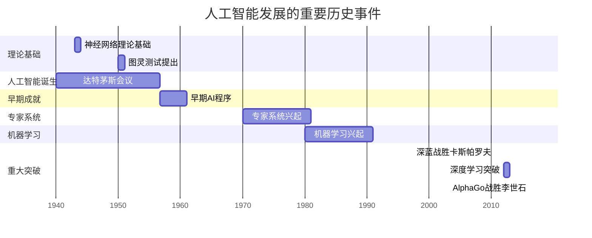

```mermaid
gantt
    title 人工智能发展的重要历史事件
    dateFormat  YYYY-MM-DD
    axisFormat %Y

    section 理论基础
    神经网络理论基础 :a1, 1943-01-01, 1943-12-31
    图灵测试提出 :after a1, 1950-01-01, 1950-12-31

    section 人工智能诞生
    达特茅斯会议 :1940-01-01, 1956-08-31

    section 早期成就
    早期AI程序 :1956-09-01, 1960-12-31
    section 专家系统
    专家系统兴起 :1970-01-01, 1980-12-31

    section 机器学习
    机器学习兴起 :1980-01-01, 1990-12-31

    section 重大突破
    深蓝战胜卡斯帕罗夫 :1997-05-11, 1997-05-11
    深度学习突破 :2012-01-01, 2012-12-31
    AlphaGo战胜李世石 :2016-03-09, 2016-03-15

            
```