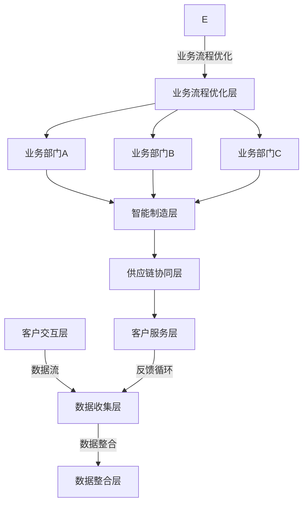

```mermaid
graph TD
    A[客户交互层] -->|数据流| B[数据收集层]
    B -->|数据整合| C[数据整合层]
   
    E -->|业务流程优化| F[业务流程优化层]
    F --> G[业务部门A]
    F --> H[业务部门B]
    F --> I[业务部门C]
    G --> J[智能制造层]
    H --> J
    I --> J
    J --> K[供应链协同层]
    K --> L[客户服务层]
    L -->|反馈循环| B

```