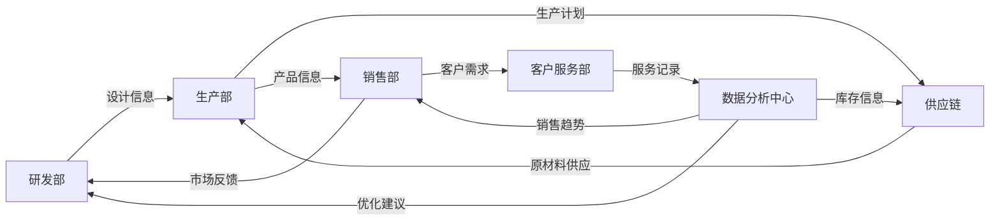

```mermaid
graph LR
    A[研发部] -->|设计信息| B[生产部]
    B -->|生产计划| C[供应链]
    C -->|原材料供应| B
    B -->|产品信息| D[销售部]
    D -->|市场反馈| A
    D -->|客户需求| E[客户服务部]
    E -->|服务记录| F[数据分析中心]
    F -->|优化建议| A
    F -->|库存信息| C
    F -->|销售趋势| D

```