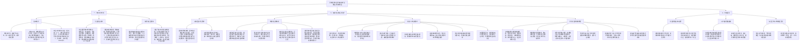

```mermaid
graph TD
    A[河南经贸职业学院双高专业群设计思维导图] --> B[一、学校现状分析]
    A --> C[二、双高专业群设计思路]
    A --> D[三、预期目标]

    B --> B1[基本情况]
    B --> B2[专业建设现状]
    B --> B3[科研与社会服务]

    B1 --> B1a[地处郑州市，始建于1950年，有71年办学历史，商学积淀深厚]
    B1 --> B1b[占地843亩，建筑面积54万平方米，设有11个二级学院和8个教学教辅部门，另设有河南省示范性软件职业技术学院1个]
    B1 --> B1c[开设三年制专科专业（含方向）47个，中外合作办学项目4个，与华北水利水电大学联合举办应用本科专业3个，在校本、专科学生23000余人]

    B2 --> B2a[专业发展聚焦现代服务业，形成会计、电子商务、工商企业管理、金融管理、大数据技术与应用、物联网、旅游管理、视觉传播设计与制作、学前教育和工程造价等10个专业群]
    B2 --> B2b[建设有财务管理、网络营销、物联网应用技术、计算机应用技术国家骨干专业4个，全国职业院校民族文化传承与创新示范专业点1个，省级综合改革试点专业7个]

    B3 --> B3a[建立“数智财经创新工程研究中心”，致力于大数据、人工智能技术在财经领域的应用技术研究，服务区域数字经济发展]
    B3 --> B3b[建立马渡乡村振兴实践基地，召开首届“魅力马渡”乡村振兴文化创意设计大赛，推进区域内村庄联建、产业联姻、人才联动、文化联培、美育共育，助力区域经济社会发展]

    C --> C1[对接区域产业需求]
    C --> C2[构建专业群体系]
    C --> C3[创新人才培养模式]
    C --> C4[优化专业群结构要素]

    C1 --> C1a[围绕中原城市群、郑州航空港经济综合试验区、中国（河南）自由贸易试验区、中原科技城建设等区域产业发展需求，服务区域经济发展]
    C1 --> C1b[以现代商贸服务业为核心，探索形成“一核引领、双翼支撑、四联驱动”三级专业群建设布局]

    C2 --> C2a[以服务区域产业为目标，通过判断产业链技术技能人才的需求状况，构建与产业发展需求相匹配的专业群体系]
    C2 --> C2b[重点分析专业群对接产业链中的环节，使专业链与产业链有效对接，形成办学特色和竞争优势]
    C2 --> C2c[考虑企业岗位设置背景，尽可能多地覆盖行业岗位群内的职业岗位，提升学生实际就业岗位与专业群岗位的吻合度]
    C2 --> C2d[选择具有相互独立且相互关联关系的专业，通过共建共享教学资源，形成相互协同且彼此竞争的氛围，激活专业改革原动力，形成可持续发展的集聚力]

    C3 --> C3a[坚持立德树人，构建“德技双修、标准引领、产教融合、校企联动”人才培养模式]
    C3 --> C3b[构建基于工作过程岗位核心职业能力为主线的课程体系，打造优质课程和教学资源平台]
    C3 --> C3c[推进“三教”改革，打造国内一流高职专业核心课程的“金课”，编制国家规划教材]
    C3 --> C3d[加强专兼结合的教学团队建设，建成高水平双师型队伍]
    C3 --> C3e[完善实践教学条件，校企共建省级以上校内外实训基地或产教融合基地]
    C3 --> C3f[校企共培共建高端技术技能创新平台，积极开展社会服务]
    C3 --> C3g[加强国际合作，与境外院校开展深度合作，引进国外行业标准，开展国际职业资格认证]

    C4 --> C4a[统筹兼顾专业群的结构要素，包括专业设置、课程体系、师资队伍、实践教学基地、技术技能平台、社会服务等方面]
    C4 --> C4b[构建模块化课程体系，融入思政元素，开发相关方向的认证课程，建立证书学分认定机制]
    C4 --> C4c[采用“科学融入创意、技术融入设计”的双融入培养理念，构建“双融入、三融通、三递进”的专业群人才培养模式]
    C4 --> C4d[构建“竞赛+项目”的“研教学赛创”实践教学模式，提升专业技能]
    C4 --> C4e[搭建高水平“企业+学校”双跨界教师结构，打造“三师领衔”的专业群师资队伍]
    C4 --> C4f[建设基于利益相关者的多方协同专业群可持续发展保障机制]

    D --> D1[专业群建设水平提升]
    D --> D2[人才培养质量提高]
    D --> D3[校企合作与产教融合深化]

    D1 --> D1a[建成省级高水平专业群，发挥高端技术技能人才培养示范作用]
    D1 --> D1b[实现群内所有专业对应升格为职业本科专业，并新增报专业，达到群内共7个专业]

    D2 --> D2a[培养具有科技创新意识和国际视野、能应用现代数字化先进技术和可设计可操作的复合型技术技能人才]
    D2 --> D2b[提高毕业生的水平、就业率，增强社会支持力度，提升服务社会的水平和质量]

    D3 --> D3a[校企合作更紧密，产教深度融合，校内实训和校外实践开展良好]
    D3 --> D3b[建立校企融合共享机制，实现教学、研发、生产、市场的成果转化]
            
```