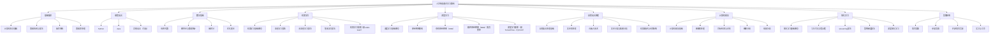

```mermaid
graph TD
    A[人工智能通识学习路线] --> B[基础知识]
    A --> C[编程语言]
    A --> D[数学基础]
    A --> E[机器学习]
    A --> F[深度学习]
    A --> G[自然语言处理]
    A --> H[计算机视觉]
    A --> I[强化学习]
    A --> J[实践应用]

    B --> B1[计算机科学基础]
    B --> B2[数据结构与算法]
    B --> B3[操作系统]
    B --> B4[数据库原理]

    C --> C1[Python]
    C --> C2[Java]
    C --> C3[其他语言（可选）]

    D --> D1[线性代数]
    D --> D2[概率论与数理统计]
    D --> D3[微积分]
    D --> D4[优化理论]

    E --> E1[机器学习基础概念]
    E --> E2[监督学习算法]
    E --> E3[无监督学习算法]
    E --> E4[集成学习算法]
    E --> E5[机器学习框架（如scikit-learn）]

    F --> F1[深度学习基础概念]
    F --> F2[神经网络架构]
    F --> F3[卷积神经网络（CNN）]
    F --> F4[循环神经网络（RNN）及其变体]
    F --> F5[深度学习框架（如TensorFlow、PyTorch）]

    G --> G1[自然语言处理基础]
    G --> G2[文本预处理]
    G --> G3[词嵌入技术]
    G --> G4[文本分类与情感分析]
    G --> G5[机器翻译与问答系统]

    H --> H1[计算机视觉基础]
    H --> H2[图像预处理]
    H --> H3[目标检测与识别]
    H --> H4[图像分割]
    H --> H5[视频分析]

    I --> I1[强化学习基础概念]
    I --> I2[马尔可夫决策过程]
    I --> I3[Q-learning算法]
    I --> I4[策略梯度算法]
    I --> I5[深度强化学习]

    J --> J1[项目实践]
    J --> J2[参加竞赛]
    J --> J3[开源项目贡献]
    J --> J4[实习与工作]
```